# Dual Coral TPU m.2 E key to NVME m.2 M key adapter

## Overview

Simple adapter to install up to 2 dual Coral TPU modules in m.2 E key format to m.2 M key 2280 nvme slot.
Single E key Coral modules and a combination of single and dual ones should work as well.
The idea was to create a simple and affordable adapter on a two-layer PCB that can be soldered without 
any special equipment and professional soldering skills. The drawback is that it relies on some specific 
hardware and components, but they are still relatively easy to purchase. Also it goes out of m.2 2280 slot dimensions
by 8 mm on the side of the secure screw.

Third-party references: M2 E-Key slot KiCad symbol and the footprint are taken from 
https://github.com/CRImier/MyKiCad/tree/master/Laptop%20mods with some adjustments.

## Get the PCB

You can order PCB from PBCway.com via this [link](). Buying it from PCBway (should be around $10 including delivery to 
the US) you would support the Author in his future development.

### Gerbers

Gerber files are not provided. To get them, open the Kicad project and export them. 

## Hardware and schematics

The main part is m.2 M key expansion board based on the ASM1184E chip. It splits 1 PCIE lane into 4 single ones. It 
affects the speed, but for this specific application, the PCIE speed affects only a little. The adapter is connected to 
this board with 4 USB-3 Type A male connectors. The adapter has its power supply and needs an external power source of
5-12V. The adapter's PCB is installed above the expansion board as a sandwich, having an overall height of about 25 mm 
without Coral heat sink. The dimensions allow installation into the Dell Micro 50XX/70XX case, but without a heatsink, 
so it may have issues with heat dissipation there. The author used a Chatreey iT12 mini-pc which is available on 
Aliexpress without its bottom cover. The adapter hangs over m.2 2280 secure screw by around 8 mm. But in most cases, 
it should not be an issue.

An example of the adapter installed in the Dell Micro case (here and in some other pictures is the first version of the 
adapter that has a slightly different layout, but the same dimensions):

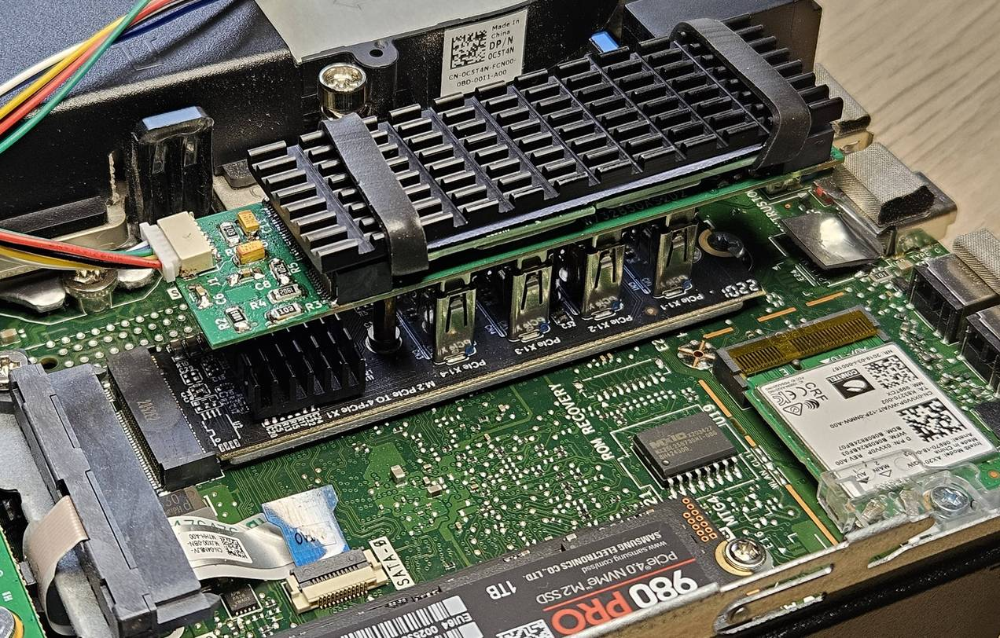

An example of the adapter installed in Chatreey iT12 mini-pc case:

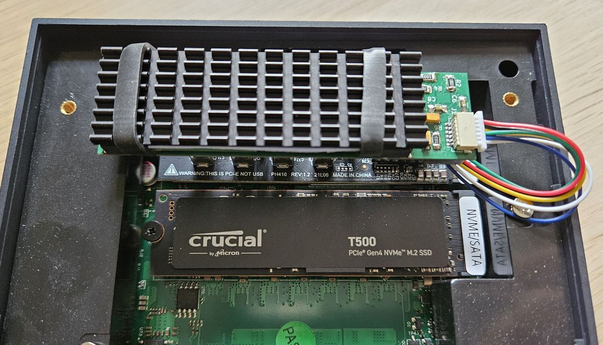

### PCIE connections

Pretty straightforward. A few lanes are swapped to make it easier to trace the PCB. CLKREQ# pins are connected to
pull-up resistors. PERST# pins are combined as the AS1184 board has them all connected. PEWAKE# pins are not used.

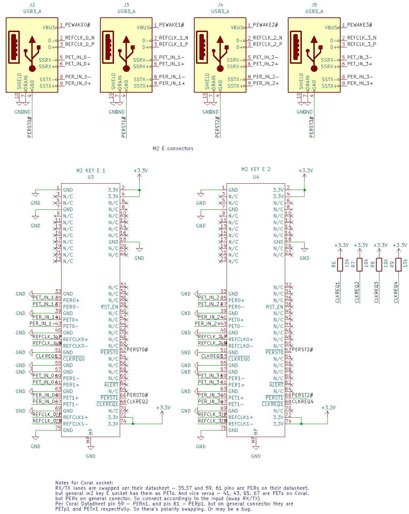

### Power supply

ASM1184 datasheet is not available, but it heats up very well suspiciously consuming a significant current.
4 TPUs may consume around 6W, so it may be not enough for an m2 socket to handle that power. That's why a
separate power supply is introduced for Coral modules. It can be supplied from a 5 to 12 V power source.
It is based on the FR9889 chip and has the following schematics:

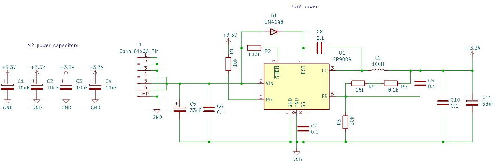

According to datasheet, R4 + R5 both should be 26.2 kOhm, but it can be something in between of 25.5 to 27.0 kOhm

The full schematics in PDF is [here](media/schematics.pdf) 

### Heat dissipation

ASM1184 board comes with its heatsink. Four Coral TPUs are heated up pretty quickly, so it is _necessary_ to have a 
heatsink for them as well. The author used a standard m2 SSD heatsink with a 1.0 mm thermal pad were secured by 2 
rubber rings.

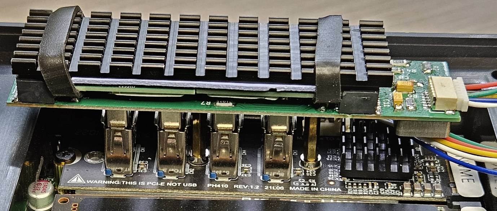

## PCB layouts

Front:

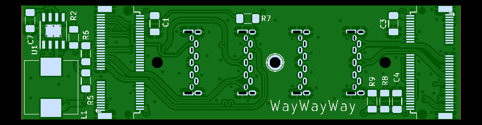

Bottom:

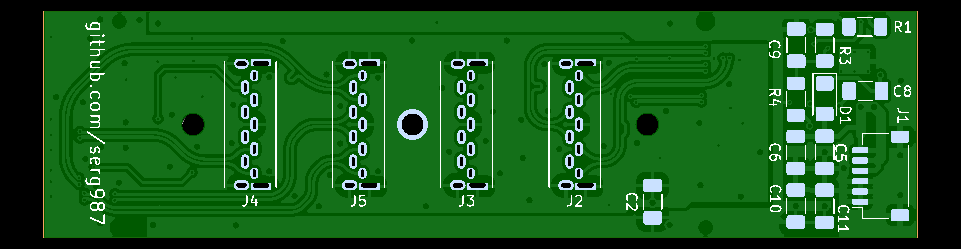

Again, you can order PCBs [here]()

## Parts and materials

| Part                                     | Picture                                                                                     | Link to buy                                                                                                                                                                                                                                                                                    | Comments                                                                                                                                                         |
|------------------------------------------|---------------------------------------------------------------------------------------------|------------------------------------------------------------------------------------------------------------------------------------------------------------------------------------------------------------------------------------------------------------------------------------------------|------------------------------------------------------------------------------------------------------------------------------------------------------------------|
| m.2 M key PCIE expansion card            | 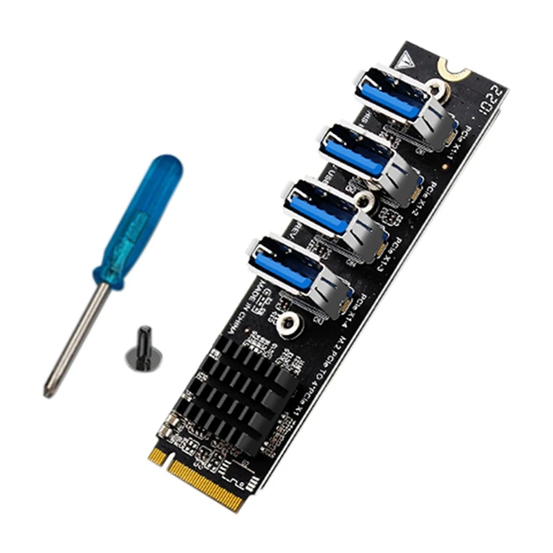              | [Aliexpress1](https://www.aliexpress.us/item/3256806084552405.html)  [Aliexpress2](https://www.aliexpress.us/item/3256804686887041.html)  [Aliexpress3](https://www.aliexpress.us/item/3256805414546446.html)  [Aliexpress4](https://www.aliexpress.us/item/3256804977336000.html) | Many of them, search by 'ASM1184 m2' on other marketplaces                                                                                                       |
| USB3 type A through hole male connector  | 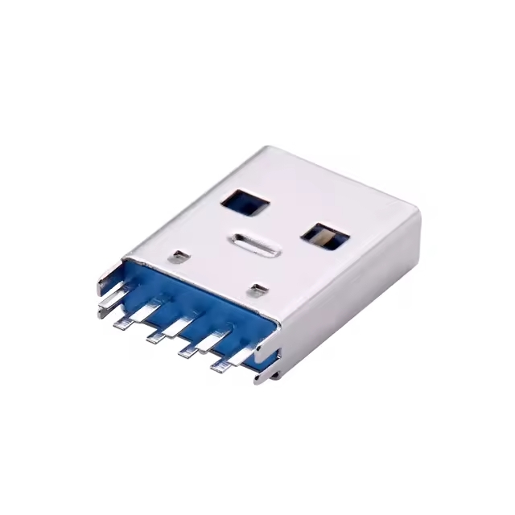 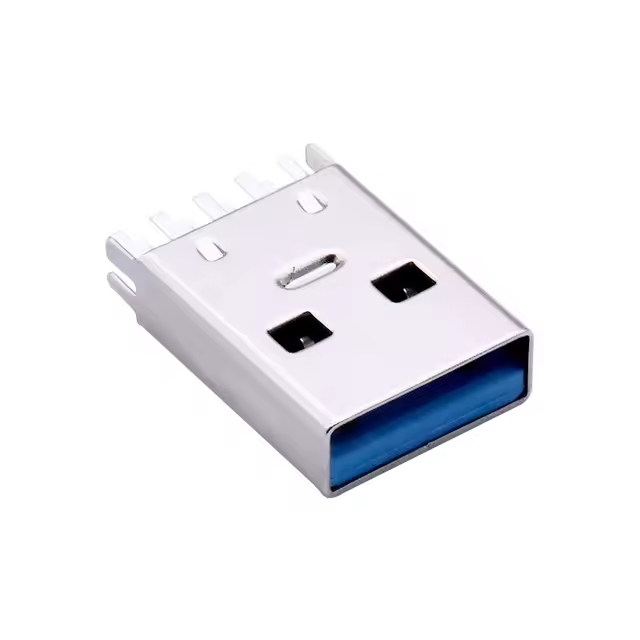                             | [Aliexpress](https://www.aliexpress.us/item/3256802702094978.html)  [Alibaba in bulk (>1000)](https://www.alibaba.com/product-detail/China-Factory-3-0-USB-Male_1600279588022.html)                                                                                                        | The most rare part. Found only in one shop on Aliexpress. But they are still available                                                                           |
| m.2 E key slot.                          | 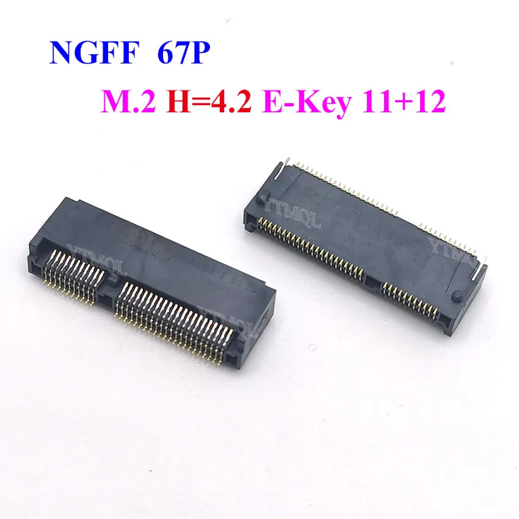 | [Aliexpress1](https://www.aliexpress.us/item/3256804027556698.html)  [Aliexpress2](https://www.aliexpress.us/item/3256804027422044.html)  [Aliexpress3](https://www.aliexpress.us/item/3256803741249397.html)                                                                          | Minimal height is 4.2 mm! Otherwise Coral PCB components will touch adapter's PCB components                                                                     |
| FR9889                                   |                                                                                             |                                                                                                                                                                                                                                                                                                | Easy to find, has a bottom pad, so requires a air soldering gun. Was not tested, but FR9888, FR9887, and FR9886 should work as well as they have the same pinout |
| R1-R9, C1-C11,D1                         |                                                                                             |                                                                                                                                                                                                                                                                                                | 1206 SMD components, no specific requirements may use 0603 and 0805 sizes as well                                                                                |
| L1 1040 10uH inductor                    |                                                                                             | [Aliexpress1](https://www.aliexpress.us/item/3256806022025333.html)  [Aliexpress2](https://www.aliexpress.us/item/3256802793808255.html)  [Aliexpress2](https://www.aliexpress.us/item/3256805451423156.html)                                                                          | Not recommended to use sizes smaller than 1040 as they have limited current                                                                                      |
| JST SH 6p male connector SMD             |                                                                                             | [male + female + wires set, Ali](https://www.aliexpress.us/item/3256805451423156.html) [same](https://www.aliexpress.us/item/3256805601260635.html)                                                                                                                                        | should be SMD and SH (1.0 mm pitch)                                                                                                                              |
| M2 standoffs: 17 and 2 or 3 mm in height |                                                                                             | [Aliexpress1](https://www.aliexpress.us/item/3256802766024100.html)  [Aliexpress2](https://www.aliexpress.us/item/3256805275813321.html)  [Aliexpress3](https://www.aliexpress.us/item/3256805110491444.html)  [Aliexpress4](https://www.aliexpress.us/item/3256805863280885.html) | Optional; 2 mm for 4.2 mm m.2 E key slot and 3 mm for 4.8 mm m.2 E key slot                                                                                      |

A connector to whatever power source of 5-12V in your setup is not included in this list.
The easiest way to get the power in a real system - find a SATA power supply connector, usually it is available 
even in mini-pcs.

## Assembling

Whatever is possible and convenient, perhaps:

Solder M2 connectors as it is the hardest and the most tedious work. It is possible with only soldering iron having a 
sharp tip, there are guidances on the Internet

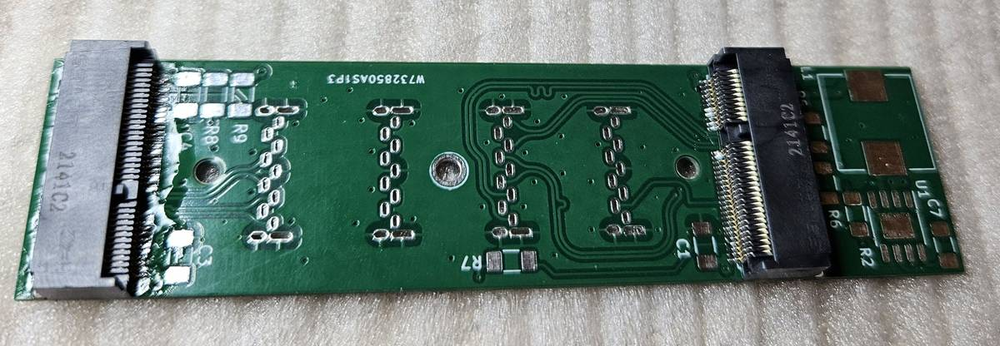

Important! After soldering double check there are no interconnected and not connected pins.

Solder FR9889 IC (or its analog, may require an air gun if it has a bottom pad, FR9887, and FR9886 in SOP-8 (NOT EP!) 
package should not have it), then solder all the front components

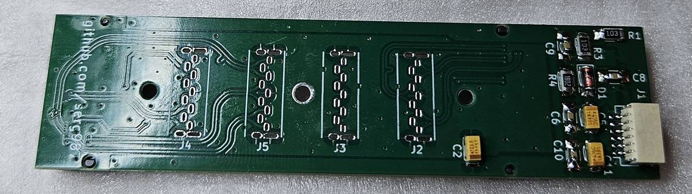

Solder all the bottom components

Make a power cable to your power source. All 3 GND and 3 Power pins should be connected due to the limited current load 
of JST SH connector. 

Connect it to the power sorce and check if 3.3V is generated and applied to all the m2 slots. If not - troubleshoot it.

The most critical part. Insert all the USB3 connectors in the expansion card

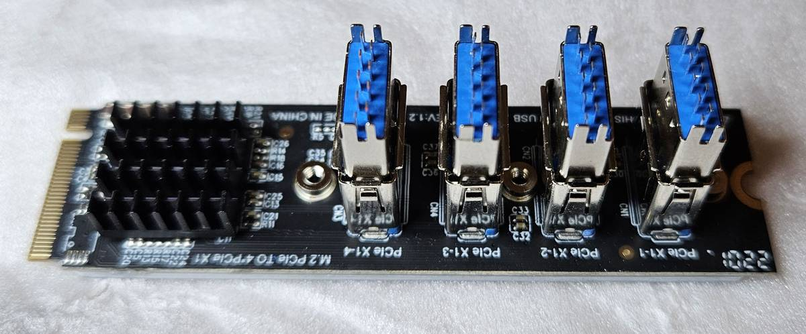

And then gently insert their pins into the adapter PCB.

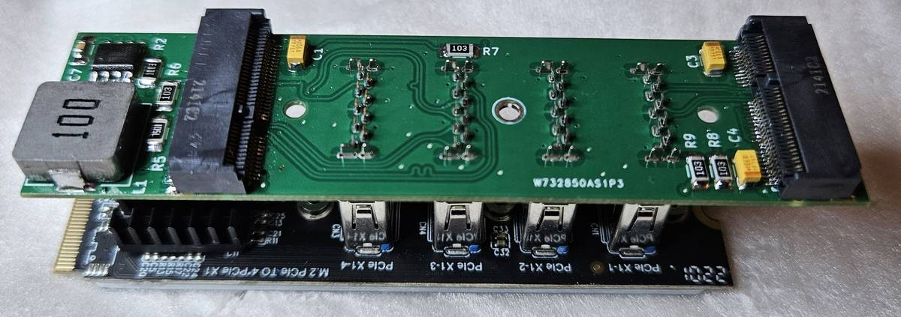

Solder them, but do not push much on the PCB as it may end up bent. 

Gently remove the adapter PCB from the expansion card. 4 USB connectors hold it very strong, so just be careful and 
do not apply extra force.

Remove extra soldering flux even if it is a 'no-clean' one.

[Optional] Screw in 17 mm M2 standoff. You will need to screw out a screw underneath the expansion card  

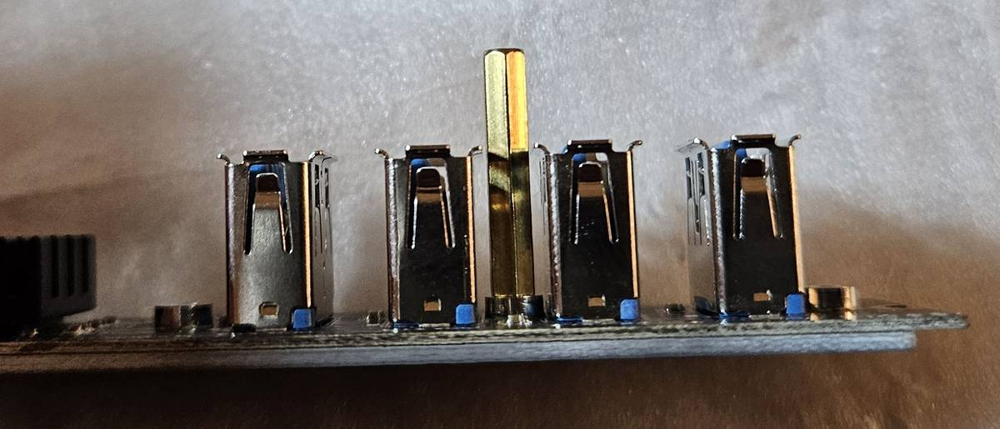

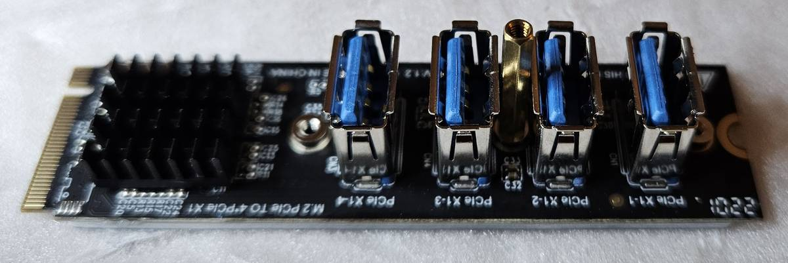

When you insert the adapter again, in the PC, you can screw in the small (2/3 mm standoff) that will hold both Coral 
modules

Another option - secure it with only a screw and two nuts - one is on the front side and another one is at the bottom.

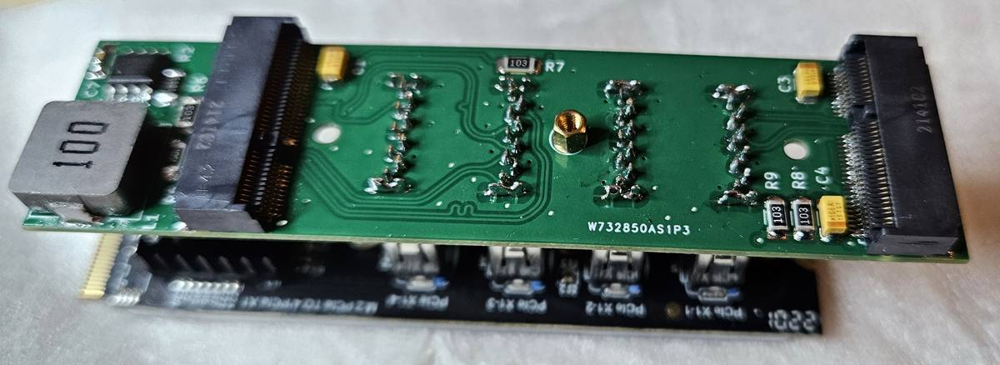

## Installation

Installation is pretty straightforward. Install PCIE expansion PCB first, and secure it with a screw.
Holding the PCIE expansion PCB slowly and gently insert the adapter. If you use standoffs, you need to screw the small 
standoff and only after that insert Coral modules. If you secure Coral modules with a screw and a nut without a long 
standoff, you can insert the adapter with Corals installed. Hold the expansion PCB while inserting and pulling out the 
adapter. 4 USB3 connectors are sitting very tight, you can damage both PCBs if not holding them properly.

Connect the power source.

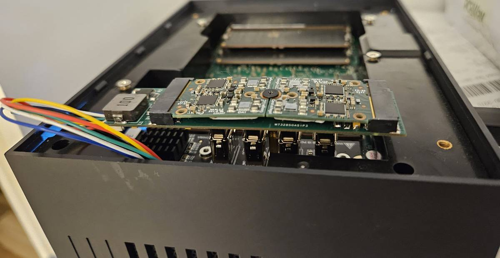

Turn on the machine, Coral TPU drivers should be installed before that.

Run `lspci` command on Linux or go to Device Manager in Windows. You should see all 4 TPUs available.

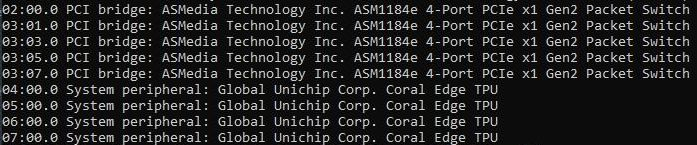

Freegate or Codeproject.ai can use 4 TPUs as well.

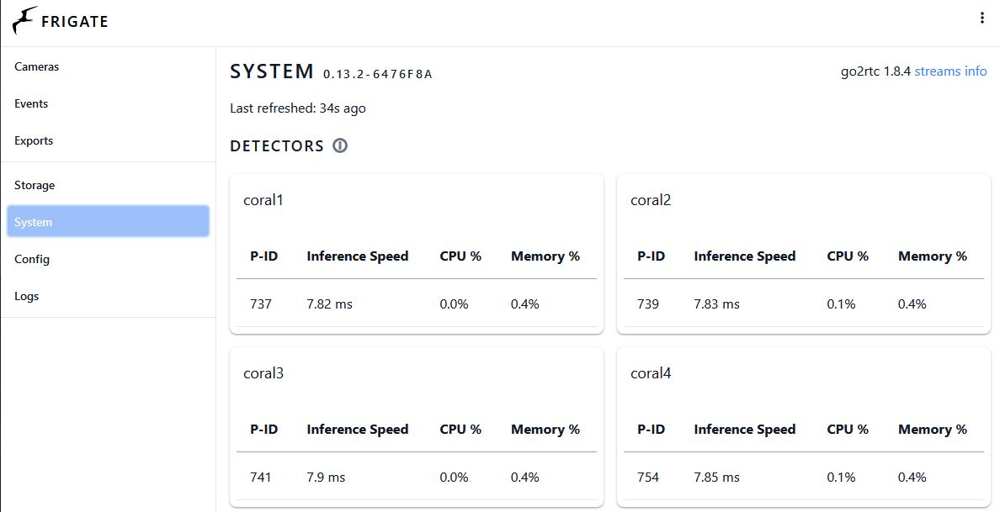

Add a heatsink after you check everything works. Will need to remove the Corals and insert them again.

## Known issues

- No USB3 through-hole connector footprint was found, so created its own one. It is not clear if it is suitable for 
automated assembly
- Silkscreen does not have electrolytic capacitor polarity
- A few m2 connector GND pins have traces between pins inside the footprint. Even if it has no electrical side effects,
it makes it a bit harder to solder
